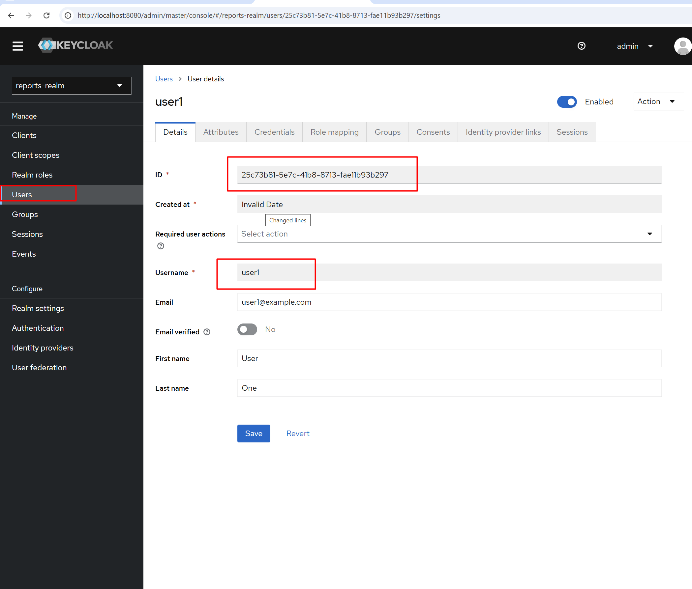

# BionicPRO - Система отчётов по протезам

## Состав системы

| Сервис | Порт | Назначение |
|--------|------|------------|
| Keycloak | 8080 | Аутентификация пользователей |
| Airflow | 8081 | ETL-процессы |
| ClickHouse | 8123 | Хранилище отчётов |
| Backend API | 8000 | API для получения отчётов |
| Frontend | 3000 | Пользовательский интерфейс |

## Запуск системы

```bash
docker-compose up -d
```

## Создание тестового пользователя

**Можно воспользоваться пользователем user1 / password123, он создается автоматически, можно пропустить этот шаг**

Пользователь ivan_petrov (на screenshots) не создаётся автоматически. Выполните следующие шаги:
### 1. Зайдите в Keycloak Admin Console
    - URL: http://localhost:8080
    - Логин: admin / Пароль: admin
### 2. Выберите realm reports-realm (выпадающий список в левом верхнем углу)
### 3. Создайте пользователя
    - Перейдите в Users → Add user
    - Заполните:
        - Username: ivan_petrov
        - Email: ivan@example.com
        - First Name: Иван
        - Last Name: Петров
    - Нажмите Create

### 4. Установите пароль
    - Перейдите на вкладку Credentials
    - Введите пароль: test123
    - Выключите Temporary
    - Нажмите Set password
### 5. Скопируйте User ID
Для user1 найдите его ID и скопируйте
На странице пользователя скопируйте ID (например, 03c1190b-6941-4c68-8028-e0a6d18133cf)


## Загрузка тестовых данных

### 1. Обновите CSV-файлы с правильным User ID (для user1 можно пропустить этот шаг)
    - В папке airflow/data/ отредактируйте файлы:
        - crm_data.csv — замените user_uuid на скопированный ID
        - telemetry.csv — замените user_uuid на тот же ID
### 2. Запустите Airflow DAG
    - URL: http://localhost:8081
    - Логин: admin / Пароль: admin
    - Найдите DAG prosthesis_etl_report
    - Нажмите Trigger DAG → Trigger
    - Дождитесь, пока все задачи станут зелёными  
### 3. Проверьте данные в ClickHouse
```bash
docker exec clickhouse-server clickhouse-client --user airflow --password airflow123 --query "SELECT * FROM reports_db.prosthesis_report FORMAT Pretty"
```
или

```web
http://localhost:8123/?user=airflow&password=airflow123&query=SELECT+*+FROM+reports_db.prosthesis_report+FORMAT+Pretty
```
## Доступ к приложению

**Логин: user1 / password123 - заранее созданный пользователь**

    - Frontend: http://localhost:3000
    - Логин: ivan_petrov / test123 - пройти процедуру смены пароля
    - Нажмите «Получить отчёты»

    или через swagger
    - Backend API Docs: http://localhost:8000/docs
    - Авторизуйтесь через кнопку Authorize с токеном из фронтенда

## Устранение неполадок, если возникнут 

### Если не запустился контейнер backend
```bash
docker-compose up -d backend
docker-compose ps backend

```
